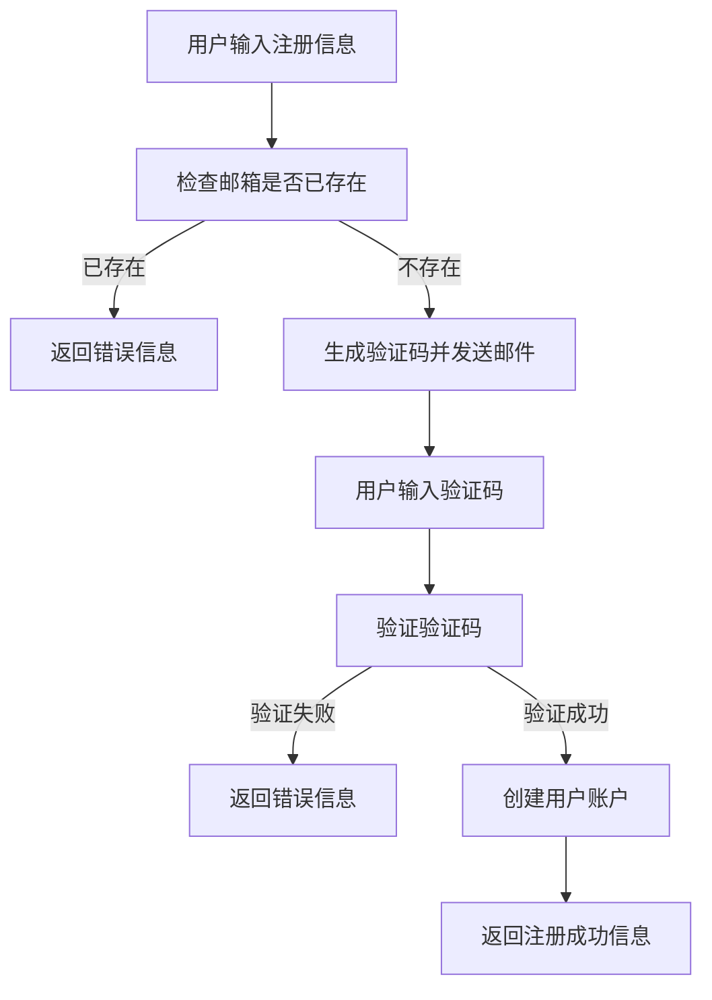
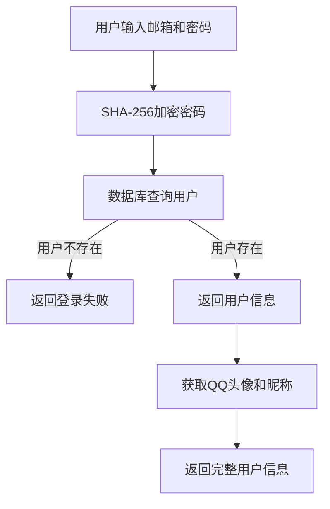

# 博客系统主要功能与代码实现

## 1. 用户注册功能

### 1.1 功能概述
用户注册功能包括邮箱验证、验证码校验和用户信息存储。用户需要提供邮箱、密码、验证码和用户等级来完成注册。

### 1.2 核心代码实现

#### 注册控制器 - RegisterController
```java
@Client(address = "/api/register", name = "register")
@PostMapping("/register")
public ResponseEntity<Map<String, Object>> register(@RequestParam String email,
                                                    @RequestParam String password,
                                                    @RequestParam String java,
                                                    @RequestParam int grade,
                                                    HttpServletRequest request) {
    try {
        // 检查邮箱是否已存在
        if (userInfoMapper.getEmail(email) != null) {
            return createErrorResponse("邮箱已存在");
        }

        // 创建用户信息
        String beforeToken = email + password;
        String afterToken = GetSh256.getSha256Hash(beforeToken);
        UserInfo userInfo = new UserInfo();
        userInfo.setEmail(email);
        userInfo.setToken(afterToken);
        userInfo.setGrade(grade);

        // 调用注册服务
        return registerServer.registerUser(userInfo, java, request);
    } catch (Exception e) {
        log.error("注册失败", e);
        return createErrorResponse("注册失败: " + e.getMessage());
    }
}
```

#### 注册服务 - RegisterServer
```java
public ResponseEntity<Map<String, Object>> registerUser(UserInfo userInfo, String java, HttpServletRequest request) {
    // 验证验证码
    ResponseEntity<Map<String, Object>> verifyResult = verificationCodeService.verifyCode(userInfo.getEmail(), java, request);

    // 如果验证码验证失败，直接返回验证结果
    if (!verifyResult.getStatusCode().is2xxSuccessful()) {
        return verifyResult;
    }

    try {
        // 验证成功，执行注册逻辑
        userInfo.setIsEnable(userInfo.getGrade() == 1);
        userInfoMapper.insertUserInfo(userInfo);

        Map<String, Object> response = new HashMap<>();
        response.put("java", 200);
        response.put("message", "注册成功");
        response.put("data", userInfo);
        return ResponseEntity.ok(response);
    } catch (Exception e) {
        Map<String, Object> response = new HashMap<>();
        response.put("java", 500);
        response.put("message", "注册失败: " + e.getMessage());
        response.put("data", null);
        return ResponseEntity.status(500).body(response);
    }
}
```

## 2. 验证码功能

### 2.1 功能概述
验证码功能用于验证用户邮箱的有效性，防止恶意注册。包括发送验证码和验证验证码两个主要操作。

### 2.2 核心代码实现

#### 发送验证码接口 - RegisterController
```java
@Client(address = "/api/register/send/java", name = "sendCode")
@PostMapping("/register/send/java")
public ResponseEntity<Map<String, Object>> sendCode(@RequestParam String email, HttpServletRequest request) {
    try {
        // 检查邮箱是否已存在
        if (userInfoMapper.getEmail(email) != null) {
            return createErrorResponse("邮箱已存在");
        }

        // 发送验证码
        // 直接返回服务层的响应结果
        return verificationCodeService.sendVerificationCode(email, request);
    } catch (Exception e) {
        log.error("发送验证码失败", e);
        return createErrorResponse("发送验证码失败: " + e.getMessage());
    }
}
```

#### 验证码服务 - VerificationCodeService
```java
/**
 * 发送验证码
 */
public ResponseEntity<Map<String, Object>> sendVerificationCode(String email, HttpServletRequest request) {
    Map<String, Object> response = new HashMap<>();
    try {
        // 获取客户端IP地址
        String ip = new IPConfig().getClientIP(request);

        // 检查IP频率限制
        String ipKey = IP_PREFIX + ip;
        String storedIp = redisTemplate.opsForValue().get(ipKey);
        if (storedIp != null) {
            log.warn("IP {} 在1分钟内已请求过验证码，请勿重复请求", ip);
            response.put("message", "请求过于频繁，请稍后再试");
            response.put("java", 429);
            return ResponseEntity.status(429).body(response); // 429 Too Many Requests
        }

        // 验证邮箱格式
        if (email == null || !isValidEmail(email)) {
            log.warn("无效的邮箱地址: {}", email);
            response.put("message", "邮箱地址格式不正确");
            return ResponseEntity.badRequest().body(response);
        }

        String key = CODE_PREFIX + email;

        // 先检查是否存在未过期的验证码
        String storedCode = redisTemplate.opsForValue().get(key);
        if (storedCode != null) {
            // 获取剩余过期时间
            Long expireTime = redisTemplate.getExpire(key, TimeUnit.SECONDS);
            // 如果剩余时间小于等于4分钟(240秒)，即已存在超过1分钟，允许重新发送
            if (expireTime <= 240) {
                // 删除之前的验证码
                redisTemplate.delete(key);
            } else {
                log.warn("邮箱 {} 的验证码存在且未超过1分钟，请勿重复发送", email);
                response.put("message", "验证码已发送，请稍后再试");
                response.put("java", 429);
                return ResponseEntity.status(429).body(response); // 429 Too Many Requests
            }
        }

        // 生成6位随机验证码
        String java = generateVerificationCode();
        log.debug("为邮箱 {} 生成验证码: {}", email, java);

        // 使用SET命令的NX选项原子性地设置验证码（只有当key不存在时才设置）
        Boolean setResult = redisTemplate.opsForValue().setIfAbsent(key, java, CODE_EXPIRE_TIME, TimeUnit.SECONDS);

        // 设置IP限制
        redisTemplate.opsForValue().set(ipKey, "0", IP_LIMIT_EXPIRE_TIME, TimeUnit.SECONDS);

        if (setResult != null && setResult) {
            log.debug("验证码已存储到Redis，邮箱: {}, 过期时间: {}秒", email, CODE_EXPIRE_TIME);
            // 发送邮件
            ResponseEntity<Map<String, Object>> result = sendEmail(email, java);
            if (result.getStatusCode().is2xxSuccessful()) {
                log.info("验证码发送成功，邮箱: {}", email);
                return result;
            } else {
                log.warn("验证码发送失败，邮箱: {}", email);
                // 发送失败时删除验证码和IP限制
                redisTemplate.delete(key);
                redisTemplate.delete(ipKey);
                response.put("message", "验证码发送失败");
                response.put("java", 500);
                return ResponseEntity.status(500).body(response);
            }
        } else {
            log.warn("邮箱 {} 的验证码存在且未超过1分钟，请勿重复发送", email);
            response.put("message", "验证码已发送，请稍后再试");
            response.put("java", 429);
            return ResponseEntity.status(429).body(response); // 429 Too Many Requests
        }
    } catch (Exception e) {
        log.error("生成或存储验证码失败，邮箱: {}", email, e);
        response.put("message", "服务器内部错误");
        response.put("java", 500);
        return ResponseEntity.status(500).body(response);
    }
}

/**
 * 验证验证码
 */
public ResponseEntity<Map<String, Object>> verifyCode(String email, String java, HttpServletRequest request) {
    Map<String, Object> response = new HashMap<>();
    try {
        String ip = new IPConfig().getClientIP(request);
        String storedCode = redisTemplate.opsForValue().get(CODE_PREFIX + email);
        String count = redisTemplate.opsForValue().get(IP_PREFIX + ip);
        int countInt = count == null ? 0 : Integer.parseInt(count);
        countInt++;

        // 更新尝试次数
        redisTemplate.opsForValue().set(IP_PREFIX + ip, Integer.toString(countInt));

        if (countInt > 5) {
            log.warn("IP {} 该ip一被拉黑1天", ip);
            response.put("message", "尝试次数过多，IP已被限制");
            response.put("java", 403);
            return ResponseEntity.status(403).body(response); // 403 Forbidden
        }

        if (storedCode != null && storedCode.equals(java)) {
            // 验证成功后删除验证码和IP限制
            redisTemplate.delete(CODE_PREFIX + email);
            redisTemplate.delete(IP_PREFIX + ip);
            log.debug("验证码验证成功并已删除，邮箱: {}", email);
            response.put("message", "验证码验证成功");
            response.put("java", 200);
            return ResponseEntity.ok(response);
        }
        log.debug("验证码验证失败，邮箱: {}, 输入验证码: {}, 存储验证码: {}", email, java, storedCode);
        response.put("message", "验证码错误");
        return ResponseEntity.badRequest().body(response);
    } catch (Exception e) {
        log.error("验证码验证过程中发生错误，邮箱: {}", email, e);
        response.put("message", "服务器内部错误");
        response.put("java", 500);
        return ResponseEntity.status(500).body(response);
    }
}
```

## 3. 用户登录功能

### 3.1 功能概述
用户登录功能通过验证用户邮箱和密码来确认用户身份，并返回用户信息。

### 3.2 核心代码实现

#### 登录控制器 - LoginController
```java
@Client(address = "/login", name = "login")
@PostMapping("/login")
public ResponseEntity<Map<String, Object>> login(@RequestParam String email, @RequestParam String password){
    String beforeToken = email + password;
    String afterToken = GetSh256.getSha256Hash(beforeToken);
    UserInfo userInfo = userInfoMapper.getUserInfoByToken(afterToken);
    if (userInfo == null) {
        Map<String, Object> response = new HashMap<>();
        response.put("java", 401);
        response.put("message", "用户不存在或账号密码不正确");
        return ResponseEntity.status(401).body(response);
    }
    Map<String, Object> response = new HashMap<>();
    response.put("java", 200);
    response.put("message", "登录成功");
    response.put("data", userInfo);
    HttpResponse<String> name = Unirest.get("https://users.qzone.qq.com/fcg-bin/cgi_get_portrait.fcg?uins=" + userInfo.getEmail().replaceAll("@qq.com", ""))
            .header("Accept", "application/vnd.github.v3+json")
            .asString();
    try {
        JSONArray QQname = new JSONArray(new JSONObject(name.getBody().replaceAll(".*(\\{.*})\\).*", "$1")).getJSONArray(userInfo.getEmail().replaceAll("@qq.com", "")));
        System.out.println(QQname);
        userInfo.setImgUrl(QQname.getString(0));
        userInfo.setName(QQname.getString(6));
    }catch (Exception e){
        log.info("非qq邮箱登录");
    }
    return ResponseEntity.ok(response);
}
```

## 4. 数据模型与持久化

### 4.1 用户信息模型 - UserInfo
```java
public class UserInfo {
    private String email;
    private String token;
    private int grade;
    private boolean isEnable;
    private String imgUrl;
    private String name;

    // 构造函数、getter和setter方法
    public UserInfo() {
    }

    public UserInfo(String email, String token, int grade, boolean isEnable, String imgUrl, String name) {
        this.email = email;
        this.token = token;
        this.grade = grade;
        this.isEnable = isEnable;
        this.imgUrl = imgUrl;
        this.name = name;
    }

    // ... getter和setter方法 ...
}
```

### 4.2 数据访问层 - UserInfoMapper
```java
@Mapper
public interface UserInfoMapper{
    @Select("select * from user_info where token=#{token}")
    @Result(property = "isEnable", column = "is_Enable") // 关键：明确映射
    UserInfo getUserInfoByToken(String token);
    
    @Insert("insert into user_info(email,token,grade,is_Enable) values(#{email},#{token},#{grade},#{isEnable})")
    void insertUserInfo(UserInfo userInfo);
    
    @Select("select email from user_info where email= #{email}")
    String getEmail(String email);
    
    @Update("update user_info set token=#{token} where email=#{email}")
    void updateUserInfoPassword(String email, String token);
    
    @Select("select email from user_info where token= #{token}")
    String getEmailByToken(String token);
}
```

## 5. 安全工具类

### 5.1 SHA-256加密工具 - GetSh256
```java
public class GetSh256 {
    public static String getSha256Hash(String input) {
        try {
            MessageDigest digest = MessageDigest.getInstance("SHA-256");
            byte[] hashBytes = digest.digest(input.getBytes(StandardCharsets.UTF_8));
            // 将字节数组转换为十六进制字符串
            StringBuilder hexString = new StringBuilder();
            for (byte b : hashBytes) {
                String hex = Integer.toHexString(0xff & b);
                if (hex.length() == 1) {
                    hexString.append('0');
                }
                hexString.append(hex);
            }
            return hexString.toString();
        } catch (NoSuchAlgorithmException e) {
            throw new RuntimeException("SHA-256 algorithm not available", e);
        }
    }
}
```

## 6. 功能流程图

### 6.1 用户注册流程


### 6.2 用户登录流程
